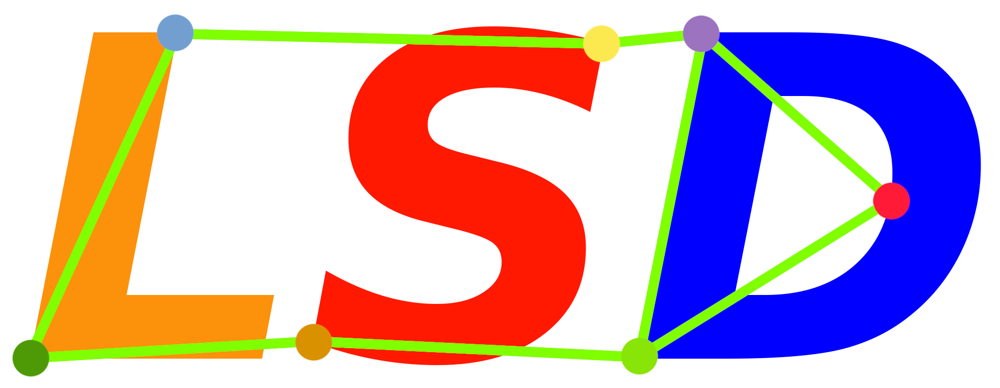
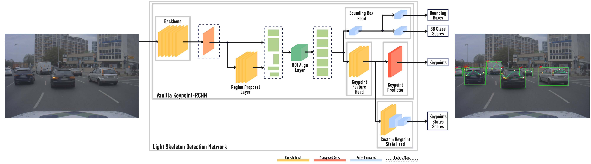

# Light Skeleton Detection: Utilizing vehicle light positions for angle agnostic signal state detection
Jonas Benjamin Krug, Martin Ludwig Zehetner & Yuan Xu



### Repository Overview 

This code implements:

Training and ROS2 node of a Keypoint-RCNN based vehicle keypoint and light states detection model.
This work was submitted to the [Autoware Challenge 2023](https://autoware.org/autoware-challenge-2023/) and is part of the ongoing research project [BeIntelli](https://be-intelli.com/) at TU-Berlin, Germany.

### Model Checkpoints 

| Dataset        | BBox AP | Keypoint AP | Download  | 
| :-------------: |:-------------:| :-----:| :-----:|
| Apollo3D (all off)     |0.51 | 0.84 | [model](https://tubcloud.tu-berlin.de/s/i4Pmg5oaJ9SdSKr)|

### Results

Fused results on custom data:


### Usage

#### Setup
To use our code it is recommended to setup conda and activate the environment provided in this repository.

#### Dataset
To train the model a dataset is first required.
We provide code to download and convert the [Apollo 3D Car Instance](https://apolloscape.auto/car_instance.html) dataset for our task.
Instructions for this can be found under training/datasets/Apollo3D.
This converted dataset provides recordings from a front facing camera with a resolution of 1920x1208 with coresponding bounding-box and keypoint labels.
However, the light states are all set to off.
Since our dataloader infers the light states from the bounding-box labels it would be straight forward to augment the dataset with the correct light states by changing the bounding-box labels to the correct classes.

#### Training
After the dataset was downloaded and converted successfully the model can be trained by executing
```
python3 LSD_train.py
```
in the training directory.

#### ROS2
To use the ROS2 node first create a weights folder in the ROS2/Node folder.
Copy the pretrained or newly trained weights here.
Update the weight path in LSD_node.py to correspond to the new weights.
Now the ROS2 node can be executed by running
```
python3 LSD_node.py
```

### Upcoming Additions to the Repository
Following the publication of our work, we will be incorporating the BeIntelli-LSD dataset, which includes multi-camera images with corresponding bounding-box, keypoint and light state labels.

### Code References
1. [PyTorch Keypoint R-CNN](https://pytorch.org/vision/main/models/keypoint_rcnn.html)
